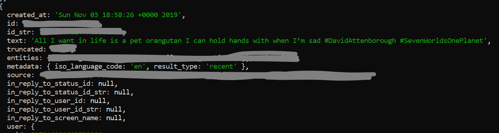

# twiter-bot

A Twitter bot created using Vanilla JavaScript and Twitter API.

The bot is searching Tweets which contain specific hashtag and keywords and is retweeting them. It checks for the new tweets every two minutes(120sec). This is the first step in creating more functional bot which will retweet with a comment depending on the keywords appearing in a tweet. 
For example; if a tweet includes keywords monkey, pet, want it will retweet it with the comment saying that monkeys are not pets and the link to the more information.
The bot will console.log data about the tweets(and user who posted it) as well as it will console.log the message if the retweet was successfull or not. 

## Instalation
Clone the repo and run npm install. 
To access the full functionallity you will need: consumer key, consumer secret, access token, access token secret. You can obtain those by creating a Twitter developer account and creating a Twitter Applicaiton.

## Screenshot

